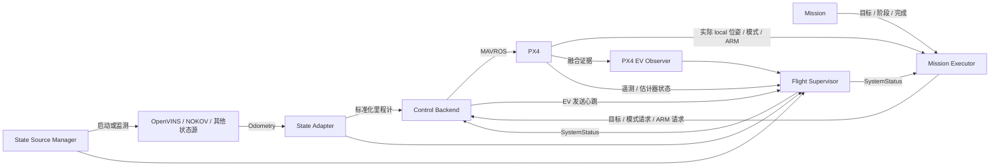

# 系统架构与使用说明

本项目是 ROS1 Noetic catkin 工作区。自有代码统一属于 `uav_system` ROS 包；OpenVINS 是同级独立源码，PX4 固件位于包内 third_party，不参与 catkin 构建。

本文描述当前实现、启动方式、任务和状态源扩展方式及终端状态。Jetson 环境、验证命令和当前验证范围见 [LOCAL_VALIDATION.md](LOCAL_VALIDATION.md)。修改 YAML 后需重新启动对应节点；文件修改不会自动更新运行中的配置。

## 1. 模块与数据流



| 模块 | 负责什么 | 不负责什么 |
|---|---|---|
| `state_source_manager` | 启动或监测指定状态源，发布数据健康和 session | 坐标转换、任务执行 |
| `state_adapter` | 外参、世界对齐、速度和协方差转换，检查数据连续性 | 目标生成、ARM |
| `mission` | 计算目标、任务阶段和完成条件 | ROS 发布、模式切换、ARM、公共故障处理 |
| `mission_executor` | 共用运行循环、预发送、实际状态确认、任务执行和降落 | PX4 控制器计算、源坐标适配 |
| `flight_supervisor` | 汇总健康条件、标定状态和真实 PX4 融合证据 | 起飞命令、轨迹生成 |
| `control_backend` | 转发里程计与目标，在实际转发前检查命令条件 | 任务规划、自行发起 ARM |
| `support/uav_core` | 共享数学、状态源配置校验、消息鲜活性和数值校验 | 任务或 Supervisor 领域逻辑 |

当前 Backend 实现是 `control_backend/px4_backend.py`，采用 PX4 原生位置控制器；没有接入 px4ctrl。Supervisor 和 PX4 EV Observer 是两个独立 ROS 节点。

### 源码与配置

以下路径相对 `src/uav_system/`：

```text
src/mission/                       # 仅任务脚本
  takeoff_hover_land.py
  hover.py
src/mission_executor/
  mission_executor_node.py          # ROS 入口、通信和执行循环
  mission_loader.py                 # 配置/任务加载、单实例锁
  execution.py                      # TaskUpdate、执行状态机、FCU 断连/重启锁定
src/flight_supervisor/
  flight_supervisor_node.py         # 状态收集与健康发布
  checks.py                        # 纯健康判断与融合证据解析
  px4_ev_observer.py                # PX4 只读查询与协议封包
src/control_backend/px4_backend.py
src/support/uav_core/
config/state_sources/              # 实机状态源
config/test/mock.yaml              # 软件 mock 状态源
config/mission/<任务名>.yaml        # 任务专属参数
config/mission_executor.yaml       # 公共执行参数
config/flight_supervisor.yaml      # 健康阈值及 observer 设置
config/px4.yaml                    # Backend 转发设置
```

源码只保留原有 `uav_core/__init__.py`；其他领域模块使用 Python 3 命名空间包，由 setup.py 导出。catkin 自动生成的包入口位于构建产物中。任务脚本单独安装并按路径加载。

## 2. 执行方式

以下命令在工作区根目录、已加载 Noetic 和本工作区环境的终端执行。Jetson 需要的额外环境见本地验证文档。

### 构建与软件等待验证

```bash
./scripts/build.sh
source devel/setup.bash
bash src/uav_system/scripts/run_checks.sh
python3 src/uav_system/test/verify_executor_wait.py
```

最后一个脚本自建独立 master 11329，启动 mock 和 Executor，结束后清理本轮进程；不会启动 MAVROS。也可手动运行 `roslaunch uav_system mock_system.launch` 查看定位链。mock 缺少真实 PX4 遥测和融合证据时，ready/arm_ready 为 false，Executor 保持 WAIT_SYSTEM。

### 基础系统与任务分别启动

先完成本地验证并确认本次任务可以执行，再使用两终端入口：

```bash
# 终端 1：基础数据链；默认启动 MAVROS、OpenVINS（包含相机）及融合观察器。
roslaunch uav_system uav_system.launch state_source:=openvins

# 终端 2：任务执行器；可以提前启动，它会等待条件满足。
roslaunch uav_system mission_executor.launch mission_source:=takeoff_hover_land
```

基础 launch 不启动 Executor。Executor 默认 `auto_arm: true`，检查通过后会请求 OFFBOARD 和 ARM，无额外开始开关。任务执行阶段不请求 POSCTL/MANUAL；正常任务完成后请求 AUTO.LAND，并在地面确认后请求 DISARM。PX4 的失效保护仍有效，程序不会在退出 OFFBOARD 后反复抢回模式。

已有外部 MAVROS 或 OpenVINS 时，可分别设置 `start_mavros:=false`、`start_source:=false`。后者仅监测外部状态源，不管理其进程。若只复用外部相机、仍由系统启动 OpenVINS，需要在源 YAML 将 `start_camera` 设为 false，并从 `owned_nodes` 删除外部相机节点；不能只关闭 MAVROS 来避免重复相机。

### 任务选择与参数覆盖

```bash
# 实际模式/ARM 确认后保持当时 xyz/yaw，默认 5 秒后降落；不主动爬升。
roslaunch uav_system mission_executor.launch mission_source:=hover

# 指定任务配置与公共执行配置。
roslaunch uav_system mission_executor.launch mission_source:=hover \
  mission_config:=/absolute/path/hover.yaml \
  executor_config:=/absolute/path/mission_executor.yaml
```

| 参数 | 默认值与含义 |
|---|---|
| `state_source` | `openvins`；默认选择同名 `config/state_sources/<名称>.yaml` |
| `source_config` | 显式覆盖状态源 YAML 路径 |
| `start_source` / `start_mavros` | 默认 true；决定是否启动对应进程 |
| `start_ev_observer` | 默认 true；启动 PX4 侧融合观察器 |
| `output_enabled` | 默认 true；false 时 Backend 不输出 EV/目标或转发飞行服务 |
| `simulation_transport` | 默认 false；true 时检查固定 loopback SITL 端点；SITL launch 显式传入对应 `fcu_url` |
| `mission_source` | 默认 `takeoff_hover_land`；支持任务名、文件名、包内路径及 Mission 目录内的绝对路径 |
| `mission_config` | 默认同名 `config/mission/<任务名>.yaml`；支持显式配置路径 |
| `executor_config` | 默认 `config/mission_executor.yaml`；选择公共执行设置 |
| `auto_arm` | 未传时使用公共 YAML，当前默认 true；显式值只接受 true/false |

旧 `arm_method:=auto/manual` 仍有弃用兼容，但新命令应使用 `auto_arm`。`auto_arm=false` 只禁止程序请求 ARM，不禁止正常降落后的 DISARM；等待实际 ARM 不套用自动解锁超时。本机历史检查中 PX4 拒绝 OFFBOARD 内遥控器 ARM，不能把此选项当作遥控器解锁一定可用的保证。

默认起飞任务：相对起始 local 高度增加 0.5 m，目标爬升速率 0.15 m/s，实际到达目标后悬停 5 秒，再降落。`hover` 只保持当前位置，不能把它当作自动起飞到指定高度的任务。

SITL 使用 `sitl_integration.launch source_config:=/absolute/path/sitl.yaml`，需要另外运行 PX4 SITL 和随机体运动的真实仿真反馈。该入口默认不启动任务；静止 mock 不能替代飞行反馈。

## 3. 配置的职责边界

| 文件 | 修改时机 | 主要内容 |
|---|---|---|
| `config/mission/<任务名>.yaml` | 改任务目标、轨迹或完成条件 | 高度、速度、航点、悬停时间、任务阶段超时等 |
| `config/mission_executor.yaml` | 改公共执行时序与反馈约束 | auto_arm、稳定窗口、预发送、模式确认/降落超时、local 鲜活与跳变阈值 |
| `config/state_sources/<源名>.yaml` | 换定位源、安装位置或输入语义 | 源 launch/topic/frame、外参、世界对齐、协方差和连续性阈值 |
| `config/flight_supervisor.yaml` | 改健康观察时序或观察器通信设置 | 状态/遥测/证据鲜活阈值、传感器诊断位图、MAVLink 身份与查询设置 |
| `config/px4.yaml` | 改 PX4/MAVROS 转发约束 | 输出开关、转发频率、canonical/命令鲜活阈值、实际目标流预发送门 |

Executor 与 Backend 的同名字段作用于各自节点，不互相覆盖。例如 Executor 的 `state_timeout` 检查 PX4 local 位姿，Backend 检查 canonical 里程计和 Adapter 健康；Executor 计时目标发布，Backend 计时实际转发。具体说明已写入两份 YAML 注释。

任务工厂只接收任务配置；任务 YAML 不能夹带公共执行字段。公共有效参数写入 `/mission_executor/*`，任务参数写入 `/mission_executor/mission`。这些伴随计算机配置不会写入 PX4 参数。

## 4. 后续添加或修改任务

| 需求 | 需要修改 | 通常不需要修改 |
|---|---|---|
| 调整现有任务的高度、时间或速率 | 任务 YAML | 任务代码、Executor、Supervisor、Backend、launch |
| 新增位置轨迹、航点或新的完成条件 | 新任务 Python 与同名 YAML，补充任务测试 | 公共执行状态机、健康门、状态源、基础 launch |
| 改公共模式确认、降落或 watchdog 行为 | Executor 与公共执行 YAML，补充执行回归 | 每个任务脚本 |
| 改为姿态/推力控制或接入 px4ctrl | Backend、指令契约及相关执行/健康判断 | 不能仅靠任务 YAML 完成 |

新任务放在 `src/mission/<任务名>.py`，配置放在 `config/mission/<任务名>.yaml`；用 `mission_source:=<任务名>` 选择，不增加新 ROS 节点或专属 launch。

任务接口：

```python
from mission_executor.execution import TaskUpdate

# create_task(config) 返回实现以下方法的任务对象：
# start(now, origin) -> TaskUpdate
# step(now, local) -> TaskUpdate
# TaskUpdate(target=(x, y, z, yaw), phase='TRACK', done=False)
```

`now` 为单调时间（秒）；`origin` 和 `local` 为 `(x, y, z, yaw)`。`start` 在健康、地面、实际 OFFBOARD/ARM 均确认后调用，获得当轮实际 local 位姿；起始当轮仍输出地面保持目标，下一轮才按任务目标执行。

任务负责校验自己的参数、限制速度/范围、定义超时和完成条件。目标必须是四个有限数值，`done` 为布尔值；阶段名不能占用 Executor 的公共状态名。`done=True` 交给 Executor 走统一降落流程。任务不得直接发布飞控目标、调用模式/ARM 服务或绕过公共检查；异常和非法输出交给公共故障流程。

当前指令只有位置和偏航，没有速度、加速度、姿态或推力字段；任务闭环反馈来自 PX4 local 位姿，不直接使用原始 OpenVINS/NOKOV 位姿。

## 5. 后续更换状态源

| 需求 | 需要修改 | 通常不需要修改 |
|---|---|---|
| 换成兼容 Odometry 的定位源 | 新源 YAML，必要时提供源侧 launch | Mission、Executor、Supervisor、Backend、坐标适配代码 |
| 改安装外参或世界轴对齐 | 源 YAML 的 extrinsic/world_alignment | 任务目标与公共执行逻辑 |
| 源输出私有 SDK、Pose 或非标准单位 | 源侧 converter/驱动，再接入 Odometry | 不在 Mission 里兼容源格式 |
| 修改健康定义或 PX4 融合证据协议 | Supervisor/Observer 与测试 | 不属于仅切换状态源 |

新增 `config/state_sources/<名称>.yaml` 后使用 `state_source:=<名称>`；临时文件也可通过 `source_config:=/absolute/path/source.yaml` 选择。NOKOV 当前是外部 Odometry 接入模板，不包含私有 SDK。

核对源配置：

- `source.launches` 和 `owned_nodes`：需要系统启动的进程及重复占用检查；外部源用 `start_source=false`。
- `input`：topic、world/body frame，以及线速度、角速度、姿态协方差表达系。输入必须是米、秒、弧度；当前角速度要求源 body frame。
- `extrinsic`：`T_SB`，即机体 base_link 原点和轴在源 sensor body 中的表达。
- `world_alignment`：`T_AW`，源 world 到 canonical odom 的固定变换。
- `adapter`：数据鲜活性、位置/姿态连续性、协方差 floor。

四元数使用 ROS Hamilton xyzw。标准输出 pose 在 Z-up `odom`，body 为 FLU `base_link`，twist 在 body 中。MAVROS 完成 EV 的 ENU/NED、FLU/FRD 适配，Backend 不重复变换。任务目标数值必须在 PX4 local ENU 中；源 world 和 canonical odom 可以有不同原点/航向，不能直接当作任务 local 坐标。

新源的 `extrinsic.calibrated`、`world_alignment.verified` 在验证前保持 false。当前 OpenVINS 的 true 来自用户对本机配置的确认，不是所有相机安装都可复用的标定结果。更换源或发生 source session/估计器 reset 后，需要重新建立基础系统和新任务，不能恢复旧任务。

## 6. 执行流程与终止行为

默认起飞任务正常流程：

```text
WAIT_SYSTEM → PRESTREAM → WAIT_OFFBOARD → WAIT_ARM
→ TAKEOFF → HOVER → WAIT_LAND_MODE → WAIT_LAND → WAIT_DISARM → DONE
```

`hover` 跳过 TAKEOFF，新任务的活动阶段使用自己的 phase。公共部分保持：

- 连续健康、通信、local 鲜活和地面确认通过后才开始预发送；预发送期间用当轮 local 更新地面保持目标。
- 每次新任务预发送后主动请求一次 OFFBOARD，即使缓存状态已是 OFFBOARD；请求后的新 `/mavros/state` 才能确认成功。
- 自动 ARM 只在实际未 ARM、实际 OFFBOARD 且检查通过时请求一次；服务成功不能代替实际 mode/armed 确认。
- 初始地面确认未知或空中时等待；准备阶段丢失地面确认则停止命令并终止。
- 飞行中健康故障在条件允许时尝试一次 AUTO.LAND；人工接管、飞控重启、断连或服务 watchdog 终止后不恢复、不重复任务、不抢回模式。
- 正常降落需实际 AUTO.LAND、实际地面和实际 disarmed 确认；禁止空中 DISARM。故障降落完成后锁定 ABORTED，不自动重新执行任务。

同一主机、同一 ROS master 只允许一个 Executor，重复启动不会替换正在运行的节点。Ctrl+C 是退出节点，不是正常完成任务的降落入口；退出后的飞控响应由实际 PX4 失效保护决定。

## 7. 终端输出与排查

### 健康检查

Supervisor 首次检查及检查结果变化时打印快照，结果不变时不刷屏。下面是输出形式示例，不表示当前飞控状态：

```text
Health checks: ready=False arm_ready=False
  [PASS] Source odometry fresh and healthy
  [PASS] State adapter healthy and source session matches
  [FAIL] FCU connected with fresh telemetry
  [FAIL] PX4 EV received and position/height fused in current session
  Details: source=...; adapter=...; reset=...; PX4 system_status=...
```

| 信息 | 含义 |
|---|---|
| `ready` | 核心数据、通信、估计器和融合观察条件是否通过 |
| `arm_ready` | ready 通过，并满足标定确认与仿真传输限制 |
| `[PASS]` / `[FAIL]` | 每项条件的结果；ON_GROUND 是 Executor 的额外起飞前条件 |
| `(diagnostic only)` | PX4 汇总状态或传感器位图仅作诊断，FAIL 不单独阻止 ready |
| `Details` | 原始源/适配器错误、锁定 reset 原因与 PX4 汇总状态 |

日志出现 WARN 不一定代表 ready=false；以完整状态的 ready、arm_ready 和 reasons 为准。项目检查通过也不等于 PX4 完整飞行前检查通过，实际 ARM 仍可能被飞控拒绝。

### 任务状态

Executor 启动打印任务脚本、任务配置、公共配置的实际路径和有效 auto_arm；状态或原因变化时打印 `Mission Executor: <状态>: <原因>`。

| 状态 | 含义 |
|---|---|
| `WAIT_SYSTEM` | 等待健康、通信、鲜活 local 与地面确认及稳定窗口 |
| `PRESTREAM` | 发布地面保持目标 |
| `WAIT_OFFBOARD` | 已请求模式，等待请求后的实际 OFFBOARD 确认 |
| `WAIT_ARM` | 等待实际 ARM；自动请求是否允许取决于 auto_arm |
| `TAKEOFF` / `HOVER` / 自定义 phase | 任务自己的活动阶段 |
| `WAIT_LAND_MODE` / `WAIT_LAND` | 等待实际降落模式 / 地面确认 |
| `WAIT_DISARM` / `DONE` | 等待实际上锁 / 正常完成 |
| `BLOCKED` | 准备阶段模式或 ARM 被拒绝/超时，任务锁定 |
| `ABORT_LAND_MODE` / `ABORT_LAND` | 故障降落流程 |
| `ABORTED` | 故障终止，不恢复 |
| `TAKEN_OVER` | 模式被人工/飞控切走，停止任务命令 |

常见原因包括 `waiting for fresh ON_GROUND confirmation`、`waiting for system readiness and fresh local pose`、`ARM rejected; inspect PX4 report`、`FCU boot clock reset; restart Mission Executor for a new mission`。Adapter 拒绝输入时还会打印 `adapter rejected odometry: ...`，包括 frame、时间戳、数值或跳变原因。

Source Manager 和 Observer 的详细状态主要发布在消息中，不是每项都会直接打印到终端。查看：

```bash
rostopic echo /uav/system/status
rostopic echo /uav/mission_executor/state
rostopic echo /uav/source/status
rostopic echo /uav/state/health
rostopic echo /uav/px4/ev_status
rostopic echo /mavros/state
rostopic echo /mavros/statustext/recv
```

`/uav/backend/ev_sent=true` 只说明本机近期发布过 EV；是否收到并实际融合，以 `/uav/px4/ev_status` 和 Supervisor 结果为准。Observer 当前只支持单 EKF，并检查真实 EV 位置/高度融合；不适配当前固件时应修正观察协议，不通过假健康绕过检查。
